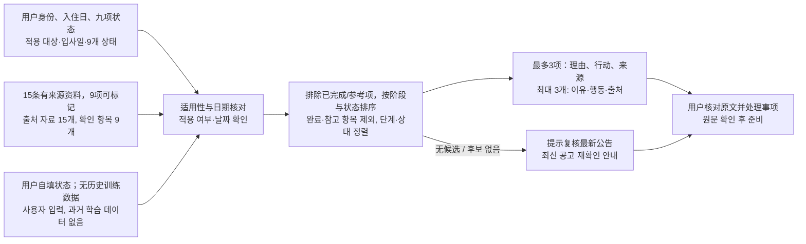

# 第 5 周小组项目汇报稿 / 5주차 팀 프로젝트 발표 원고

项目：**入住有数 · 宿舍入住准备助手**。负责人：**WANGHAOBIN（一人）**。以下是课堂约五分钟的演示稿；实际汇报尚未发生。画面、数据和结论均来自 2026-10-08 的**合成情境技术运行**，不代表真实用户测试或学校审核。

## 0:00–1:00　项目与本周功能 / 프로젝트와 이번 주 기능

**中文口述：** 我的项目把 Hanlim 生活馆的公开资料整理成有来源的入住准备清单。已有功能让用户自填身份、日期和事项状态，也可以确认 AI 提出的状态建议，再查看规则核对结果。本周我加入两项功能：一是从未完成事项中推荐最多三项下一步，二是把界面切换为中文或韩语。推荐只安排准备行动，不预测能否入住。

**한국어 발표：** 제 프로젝트는 한림생활관의 공개 안내를 출처가 있는 입사 준비 목록으로 정리합니다. 기존에는 사용자가 적용 대상과 날짜, 준비 상태를 입력하고 AI의 상태 제안을 확인한 뒤 규정에 따른 점검 결과를 볼 수 있었습니다. 이번 주에는 미완료 항목 중 최대 세 가지 다음 행동을 추천하고, 화면을 중국어와 한국어로 전환하는 기능을 추가했습니다. 이 추천은 준비 행동을 정리하며 입사 가능 여부를 예측하지 않습니다.

## 1:00–2:00　实际流程与依据 / 실제 흐름과 근거

**中文口述：** 输入是适用身份、预计入住日与九项可标记事项的准备状态。候选来自三处公开来源整理出的十五条知识，其中九项可进入推荐。程序先按适用性和材料日期核对，再排除已完成及只作参考的项目。剩余项目按当前阶段、待确认或日期异常、待准备、未知及要求类型排序，显示前三项的理由、行动和来源。这里没有历史训练数据，也没有记录推荐点击反馈。若没有未完成候选，程序提示入住前复核所属馆最新公告。

**한국어 발표：** 입력에는 적용 대상, 입사 예정일, 상태를 표시할 수 있는 아홉 항목의 준비 상황이 포함됩니다. 후보는 세 곳의 공개 출처에서 정리한 자료 열다섯 항목 가운데 확인 가능한 아홉 항목입니다. 프로그램은 적용 여부와 서류 발급일을 점검하고 완료 항목과 참고 전용 항목을 제외합니다. 남은 항목을 현재 단계, 확인 필요 또는 날짜 오류, 미준비, 미확인, 요구 유형 순으로 정렬해 상위 세 항목의 이유와 행동, 출처를 보여 줍니다. 과거 학습 데이터나 추천 클릭 기록은 사용하지 않습니다. 미완료 후보가 없으면 입사 전 해당 생활관의 최신 공고를 다시 확인하도록 안내합니다.

## 2:00–3:30　两组实际模拟结果 / 두 가지 실제 실행 사례

**中文口述：** A 是按一般入住说明办理的模拟学生，预计 11 月 1 日入住；两份材料自报已准备且填写了 9 月 30 日的开具日，床品与洗护用品未准备，网络用品未确认。实际前三项依次是床品、洗护、网络用品。B 改为留学生，两份材料虽然自报已准备，已收录资料仍不能确认对留学生的适用性；最新公告也标为未阅读。程序实际先推荐确认结核证明和居民登记誊本的适用要求，再阅读最新公告。身份与状态改变了结果；切换中文和韩语只改变文字，不改变排序。

**한국어 발표：** A는 일반 입주 안내 적용을 학교에 확인한 가상 학생입니다. 11월 1일 입사를 예정하고 두 서류를 준비 완료로 표시했으며 발급일은 9월 30일로 입력했습니다. 침구와 세탁용품은 미준비, 인터넷용품은 미확인으로 입력했습니다. 실제 상위 세 항목은 침구, 세탁용품, 인터넷용품이었습니다. B는 유학생으로 바꾸고 최신 공고를 아직 확인하지 않은 사례입니다. 두 서류를 준비했다고 표시해도 현재 자료만으로 유학생에게 적용되는지 확인할 수 없습니다. 실제 결과는 결핵검진 확인서와 주민등록등본의 적용 요건 확인이 먼저 나오고, 그다음 최신 공고 확인이 나옵니다. 적용 대상과 준비 상태가 결과를 바꾸며, 언어 전환은 표시 문자만 바꿉니다.

## 3:30–5:00　视频、回退与局限 / 영상·예외 처리·한계

**中文口述：** 视频展示 A 的输入与结果、中文转韩语、B 的输入与结果，以及所有可标记事项为已准备时的空候选提示。页面仍让每条建议回到原文。离线回归共 54 项通过，移动端韩语界面没有横向溢出。国际生材料要求在现有资料中仍不明确，程序不会把自报完成说成学校批准；真实用户测试和教师批阅也尚未发生。下阶段需要补充官方适用依据，再组织真实试用。

**한국어 발표：** 영상에는 A의 입력과 결과, 중국어에서 한국어로 전환하는 과정, B의 결과, 그리고 모든 확인 항목을 완료로 표시했을 때 추천 후보가 없다는 안내가 나옵니다. 각 추천에서 원문 근거를 확인할 수 있습니다. 오프라인 회귀 검사 54개를 통과했고 모바일 한국어 화면에는 가로 넘침이 없었습니다. 현재 자료만으로는 유학생 서류 요건을 확정할 수 없으므로, 사용자가 완료로 표시한 것을 학교 승인으로 표현하지 않습니다. 실제 사용자 테스트와 교수자의 평가도 아직 진행되지 않았습니다. 다음 단계는 공식 적용 근거를 보강하고 실제 사용자를 모집해 시험하는 것입니다.

## 演示与提交用链接 / 시연 및 제출 링크

- 项目入口 / 프로젝트 실행: `week03_dorm_assistant/Start.cmd`，浏览器打开 `http://127.0.0.1:8765`。
- 课堂独立 A/B/C 练习 / 수업용 별도 A/B/C 실습: `week05_recommendation/app.py`，与宿舍项目的推荐结果分开记录。
- GitHub: <https://github.com/ChenMengLR/AI_Project_2026_2>。
- 视频 / 영상: `evidence/Week05_Demo.mp4`；演示输入为合成数据。
- PPT: `Week05_Dorm_Recommendation_CN_KR.pptx`。

展示时若现场服务或 AI 不可用，应明确说明并使用已保存的真实运行视频。手动清单与推荐不需要 AI；课堂 A/B/C 的真实 Qwen 调用是独立练习，不可据此说宿舍项目的排序由模型训练得出。
